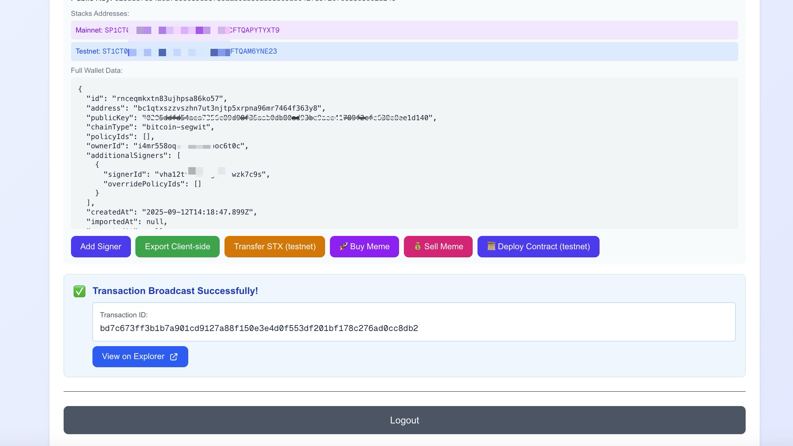

# Privy-Stacks Integration Demo

This is a Next.js demo that uses Privy authentication plus server-side wallet operations to sign and broadcast Stacks transactions.

## Demo / Prototype Positioning

- This repository is a **demo prototype** for `stackshub.space` style flows.
- It is intended for **experimental sandbox and showcase usage** (including grant demos and GitBook documentation).
- It is **not positioned as production-final** in its current form.
- Focus areas are:
  - headless app patterns
  - composable modules
  - branching narrative/ARG flows (including `Finding Nakamoto`)
  - AI-assisted authoring while preserving original authored design intent



## Important Status (Feb 16, 2026)

- This app works with Stacks by using Privy-managed wallet keys and `raw_sign` on the backend.
- It does **not** currently connect external Stacks wallets (Leather/Xverse) through Privy modal.
- WalletConnect protocol supports Stacks, but Privy external connector UX is still documented for EVM/Solana chains.

See `docs/STACKS_ARCHITECTURE.md` for the exact flow and extension plan.

## How This App Works With Stacks

1. User logs in with Privy (`usePrivy`) and gets an access token.
2. User selects a linked wallet with `walletClientType === 'privy'` in the UI.
3. Backend fetches wallet metadata/public key from Privy (`walletApi.getWallet`).
4. Backend builds an unsigned Stacks transaction (`@stacks/transactions`).
5. Backend computes pre-sign hash via `sigHashPreSign`.
6. Backend calls Privy `raw_sign` using quorum authorization signature.
7. App tries recovery ID variants (`00/01/02/03`) and broadcasts until one passes validation.
8. Response returns txid + signature/debug metadata.

## Current API Surface

- `POST /api/create-wallet`: creates wallet via Privy Wallet API (`chainType: bitcoin-segwit` in current code).
- `GET /api/get-wallet`: fetches wallet details including public key.
- `POST /api/export-key`: exports key material through Privy export flow.
- `POST /api/transfer-stx`: testnet STX transfer flow with recovery testing.
- `POST /api/deploy-contract`: testnet contract deployment flow.
- `POST /api/buy-meme`: mainnet STX.city buy flow.
- `POST /api/sell-meme`: mainnet STX.city sell flow.

## Setup

1. Install deps:

```bash
npm install
```

2. Copy env file:

```bash
cp .env.local.example .env.local
```

3. Configure required variables:

```env
NEXT_PUBLIC_PRIVY_APP_ID=your_privy_app_id
PRIVY_APP_SECRET=your_privy_app_secret
QUORUMS_PUBLIC_KEY=your_quorum_public_key
QUORUMS_PRIVATE_KEY=your_quorum_private_key
QUORUMS_KEY=your_quorum_key_identifier
```

4. Run:

```bash
npm run dev
```

## Deploy (Simple)

Use the step-by-step guide:

- `../../docs/DEPLOY_GITHUB_VERCEL.md`

## Known Gaps / Production Notes

- Mainnet meme routes contain hardcoded values that must be made dynamic:
  - `src/app/api/buy-meme/route.ts`
  - `src/app/api/sell-meme/route.ts`
- Some endpoints perform token verification inconsistently; harden auth checks before production.
- UI still says "Privy Bitcoin Demo"; functionally this repo demonstrates Stacks signing and broadcast.

## Reference Docs

- Demo POV doc (message-first): `docs/DEMO_POV_DOCUMENTATION.md`
- Architecture + degrants notes: `docs/STACKS_ARCHITECTURE.md`
- Production deploy checklist: `docs/PRODUCTION_DEPLOY_CHECKLIST.md`
- External setup checklist: `OUTSIDE_TASKS.md`
- Privy docs: https://docs.privy.io/
- Stacks docs: https://docs.stacks.co/
