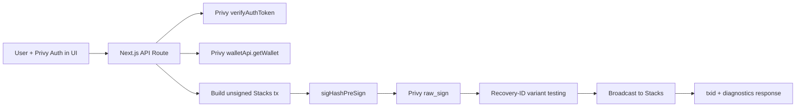
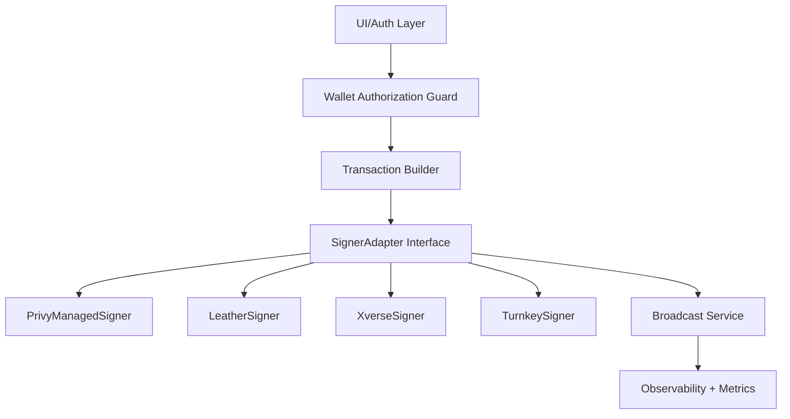

# Repository Evaluation (Iteration 1)

Date: February 17, 2026
Scope: `privy-stacks-integration-demo` fork-readiness review for public sharing

## Executive Assessment

Current state: **promising architecture direction, not yet production-safe**.

Scorecard (10 = best):
- Architecture direction: **8/10**
- Security posture: **3/10**
- Code quality/maintainability: **4/10**
- Build/release readiness: **4/10**
- Documentation quality: **7/10**

Overall recommendation: publish as a **research/demo fork** with explicit caveats, then complete the P0 remediation list before claiming production readiness.

## Key Findings (Severity-Ordered)

### Critical

1. Missing ownership authorization checks for sensitive wallet operations
- Impact: an authenticated user can potentially act on a wallet not bound to their identity if they supply a valid `walletId`.
- Evidence:
  - `src/app/api/buy-meme/route.ts:58`
  - `src/app/api/sell-meme/route.ts:60`
  - `src/app/api/transfer-stx/route.ts:47`
  - `src/app/api/get-wallet/route.ts:20`
  - `src/app/api/create-wallet/route.ts:23`
- Detail: token verification is present in some endpoints but no consistent check that `wallet.owner`/linked identity matches the verified subject.

2. `transfer-stx` continues on failed token verification
- Impact: auth bypass risk for a high-privilege signing endpoint.
- Evidence:
  - `src/app/api/transfer-stx/route.ts:41`
  - `src/app/api/transfer-stx/route.ts:43`
- Detail: `verifyAuthToken` failure is logged but does not return `401`.

### High

3. Build fails due incorrect Privy typed config
- Impact: CI/release blocker.
- Evidence:
  - `src/providers.tsx:16`
- Detail: `embeddedWallets.createOnLogin` is no longer valid at that location for the installed SDK types.

4. Export-key endpoint implementation is not using the expected Privy authorization-signature flow
- Impact: endpoint likely non-functional and potentially misleading in public repo.
- Evidence:
  - `src/app/api/export-key/route.ts:40`
- Detail: private key is set directly as `privy-authorization-signature`; this should be a generated request signature, not raw private key material.

5. Hardcoded recipients/contracts/amounts in transaction routes
- Impact: unexpected fund movement and non-reusable behavior.
- Evidence:
  - `src/app/api/transfer-stx/route.ts:64`
  - `src/app/api/buy-meme/route.ts:63`
  - `src/app/api/sell-meme/route.ts:65`
  - `src/app/api/deploy-contract/route.ts:65`
- Detail: routes are tightly coupled to demo constants instead of validated request payloads.

### Medium

6. Excessive debug statements and `debugger` statements in client flow
- Impact: operational noise and accidental production breakpoints.
- Evidence:
  - `src/app/page.tsx:71`
  - `src/app/page.tsx:140`
  - `src/app/page.tsx:244`
  - `src/app/page.tsx:684`

7. Environment variable usage is inconsistent (`NEXT_PUBLIC_PRIVY_APP_ID` vs `PRIVY_APP_ID`)
- Impact: setup errors across environments.
- Evidence:
  - `src/utils/exportPrivyWallet.ts:137`
  - `src/utils/exportPrivyWallet.ts:209`
  - `src/utils/privy-server-client.ts:14`

8. Large route handlers with mixed concerns
- Impact: difficult testing and signer portability.
- Evidence:
  - `src/app/api/deploy-contract/route.ts:27`
  - `src/app/api/buy-meme/route.ts:28`
  - `src/app/api/sell-meme/route.ts:27`

## What Is Strong

- Signing reliability strategy is directionally correct:
  - Recovery-ID variant retries via `broadcastWithRecoveryTesting` in `src/utils/stacks.ts`.
- Privy server client is centralized:
  - `src/utils/privy-server-client.ts`.
- Architecture intent is already documented well:
  - `docs/STACKS_ARCHITECTURE.md`.
- Signer-agnostic idea is present conceptually and worth preserving.

## As-Is Architecture Diagram

## Target Architecture (Future-Proof Signer Layer)

`SignerAdapter` contract (proposed):
- `getAddress(network): Promise<string>`
- `getPublicKey(): Promise<string>`
- `signPrehash(hashHex): Promise<string>`
- `kind: 'privy_managed' | 'leather' | 'xverse' | 'turnkey'`

## Iteration Plan

### P0 (before public “production-ready” claim)
1. Enforce auth + wallet ownership checks in every `/api/*` route.
2. Fix `transfer-stx` auth failure handling (`401` early return).
3. Fix `src/providers.tsx` config to match installed Privy SDK types.
4. Remove/disable `export-key` route until implemented with proper signed request flow.
5. Replace hardcoded tx params with validated request schema + allowlists.

### P1
1. Extract tx-building and signing into service modules.
2. Add shared request validation (zod or equivalent).
3. Add structured logs and remove raw debug dumps.
4. Normalize env names and create strict startup validation.

### P2
1. Implement signer adapter package boundary.
2. Add external wallet providers behind feature flags.
3. Add test coverage:
   - unit tests for signature formatting/recovery strategy
   - integration tests for API auth guards and request validation
4. Add CI gates (`typecheck`, build, tests).

## Public Fork Positioning (Suggested Wording)

This repository demonstrates a working Privy-managed Stacks signing flow with recovery-ID broadcast strategies. It is currently a demo/reference implementation and includes hardcoded transaction defaults and in-progress security hardening tasks before production use.

## Verification Performed

- Static code audit across API routes, signing utilities, providers, and docs.
- Production build run:
  - command: `npm run build`
  - result: failed at type-check with Privy config mismatch in `src/providers.tsx:16`.
